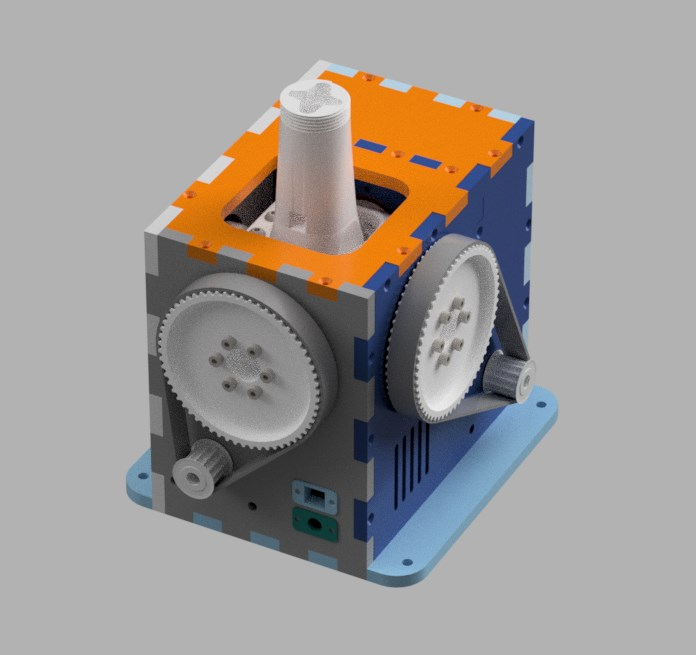

# VPForceKit-ffb-joystick-base plywood WIP
This project contains CAD files necessary for the mechanical assembly of a base of the VPForce kit (2x57BLF03 + USB kit).
It is currently only a prototype that I will develop further for my own FFB base.

 

3d-print-parts - all elements which need to be printed  
DXF - drawings for case parts for laser cutting
CAD - full STP assembly

## Bill of Materials

| Print Parts   | Quantity |
| ------------- |:--------:|
|bearing_retainer_half|4|
|bearing_retainer|4|
|customizable_fan_cover v3|1|
|GIMBAL_ARM_BEARING_PILLOW|4|
|GIMBAL_ARM_FRAME|2|
|GIMBAL_CORE_JOINT_6mm|1|
|GIMBAL_STICK_CONNECTOR TM|1|
|PULLEY_70T_Hollow|2|
|VPForce_Controller_Holder|1|

| LaserCut Parts | Quantity |
| -------------- |:--------:|
|Back-Panel|1|
|Buttom-Panel|1|
|Front-Panel|1|
|Left-Panel|1|
|Mid-Panel|1|
|Right-Panel|1|
|Top-Panel|1|
