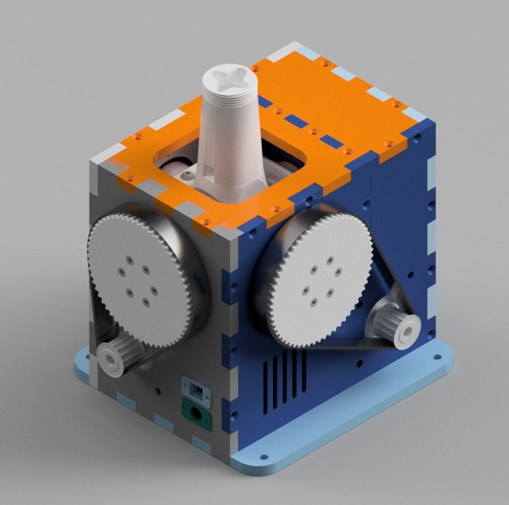

# VPForceKit-ffb-joystick-base plywood WIP
This project contains CAD files necessary for the mechanical assembly of a base of the VPForce kit (2x57BLF03 + USB kit).
It is currently only a prototype that I will develop further for my own FFB base.

 

3d-print-parts - all elements which need to be printed  
DXF - drawings for case parts for laser cutting  
CAD - full STP assembly

## Bill of Materials

| VPForce Kit   | Quantity | Link |
|-------------- |:--------:|-----:|
|57BLF03 - 57x101mm - 1.6Nm peak - 1.24kg - NEMA23|1|[link](https://vpforcecontrols.com/) |

| Print Parts   | Quantity |
| ------------- |:--------:|
|bearing_retainer_half|4|
|bearing_retainer|4|
|customizable_fan_cover v3|1|
|GIMBAL_ARM_BEARING_PILLOW|4|
|GIMBAL_ARM_FRAME|2|
|GIMBAL_CORE_JOINT_6mm|1|
|GIMBAL_STICK_CONNECTOR TM|1|
|PULLEY|2|
|VPForce_Controller_Holder|1|

| LaserCut Parts Plywood 8mm| Quantity |
| -------------- |:--------:|
|Back-Panel|1|
|Buttom-Panel|1|
|Front-Panel|1|
|Left-Panel|1|
|Mid-Panel|1|
|Right-Panel|1|
|Top-Panel|1|

| Bearings                      | Quantity  | Link |
| ----------------------------- | --------- | ---- |
| 6802                          | 8  |[link](https://amzn.eu/d/eDOVoF4/) |
| 6808                          | 4  |[link](https://amzn.eu/d/eurbt7d/) |
| F625                          | 2  |[link](https://amzn.eu/d/9N6LxrD/) |

| Motor pulley                  | Quantity  | Link |
| ----------------------------- | --------- | ---- |
| HTD-5M-14T                    | 2  |[link](https://www.zahnriemen24.de/a/40140-zahnscheiben-5m?vorbohrungspannsatz=1&bohrung=1&quantity=1/) |

| Belts                  		| Quantity  | Link |
| ----------------------------- | --------- | ---- |
| HTD-420-5M/15                 | 1  |[link](https://www.zahnriemen24.de/a/40008-zahnriemen-5m/) |
| HTD-360-5M/15                 | 1  |[link](https://www.zahnriemen24.de/a/40008-zahnriemen-5m/) |
